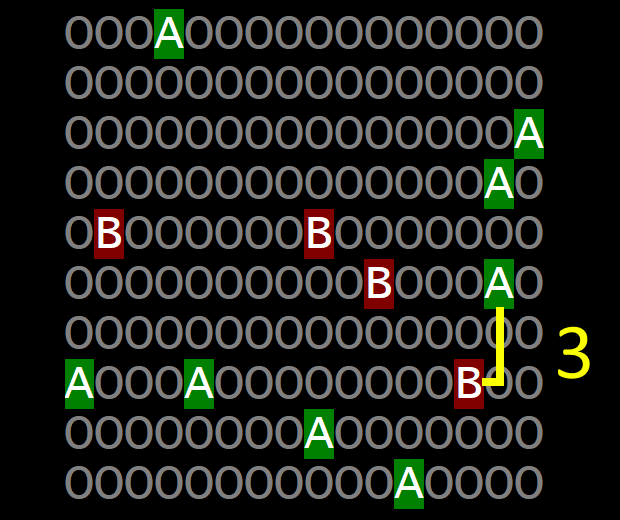
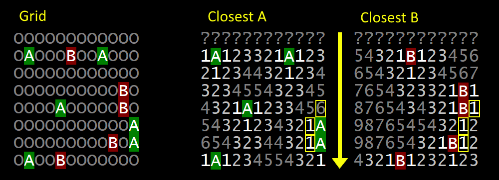
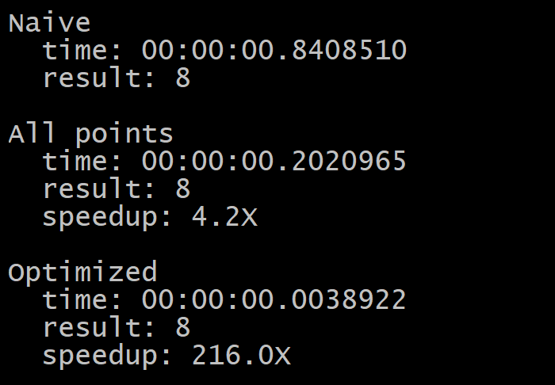

## PROBLEM

Given a 2-dimensional grid with 'A', 'B', and 'O', find the shortest distance between any 'A' and 'B', where the path must not go diagonally.

## SOLUTION

One of the optimal solutions is quite simple - for every single point on the grid find the shortest distance to any 'A' and the shortest distance to any 'B'. Then at every point on the grid the sum of distances to closest 'A' and closest 'B' gives the shortest distance between any 'A' and any 'B' at that point. The smallest sum is the answer to the problem.

Instead of calculating the entire distance map, the provided code uses 1-row distance map. The algorithm does a row-by-row scan, thus it only needs to refer to the closest 'A' or 'B' from the row above. Then, as it scans a row itself, it overwrites the 1-row distance map with newly calculated values for the current row.

As shown above, the numbers on distance maps for 'A' and 'B' are only accurate if you look at one row at a time and ignore rows below. The sum of A and B distances at any pair of highlighted cells gives the answer of 2 in this case (except the pair of 6+1).

## PERFORMANCE

Such optimized solution performs the best due to the approximate complexity of O(1) and sequential RAM access patterns.

The results above are shown for a 500x500 grid.
